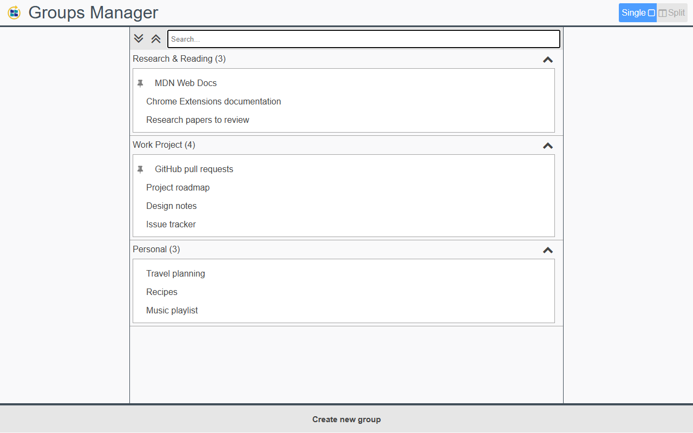
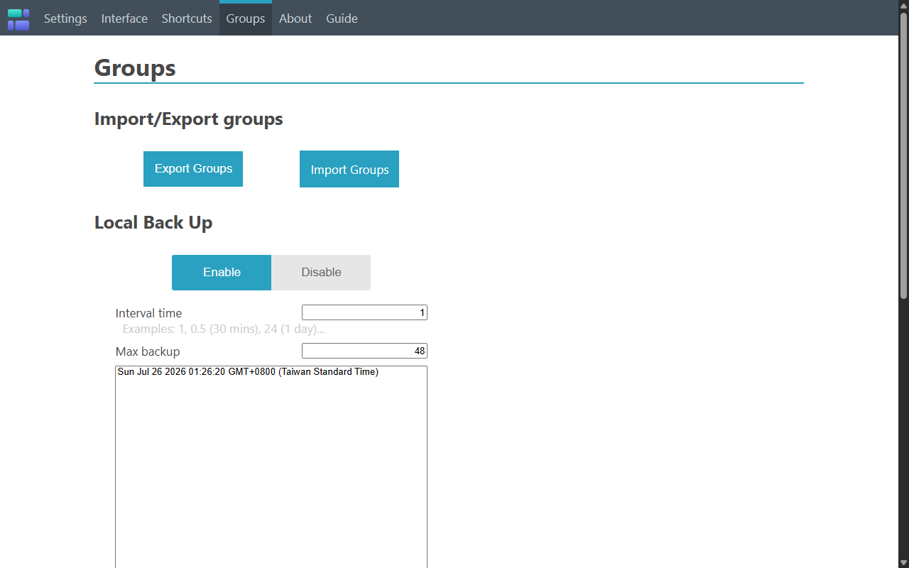

# Tab Groups Resurrection

<p align="center">
  
</p>

Tab Groups Resurrection is an independently maintained, Chromium-focused fork
of [Sync Tab Groups](https://github.com/Morikko/sync-tab-groups), originally
created by [Morikko](https://github.com/Morikko).

It keeps the original workflow of organizing tabs by topic, switching between
groups, and keeping pinned tabs inside their groups. Groups can be closed and
reopened without losing their tabs, and can be searched, moved, exported, and
backed up.

## Install

[Install Tab Groups Resurrection from the Chrome Web Store](https://chromewebstore.google.com/detail/tab-groups-resurrection/bmjkpeefoomkdgodlecgdjjgdkoldofj).

Chrome Web Store extension ID: `bmjkpeefoomkdgodlecgdjjgdkoldofj`.

## Screenshots

### Search and manage groups

See saved groups and their tabs in one searchable view. Expand or collapse
groups, identify pinned tabs, and create or reorganize groups from the full-page
manager.



### Import, export, and local backups

Import or export group data and configure automatic local backups, including
the backup interval and maximum number of saved backups.



## Current status

- The extension has been migrated from Manifest V2 to Manifest V3.
- The current fork release is `v1.0.0`.
- Chromium-based browsers are the primary maintenance target. Development and
  regression testing are currently performed with Brave.
- Groups, tabs, pinned tabs, window associations, context menus, options, and
  backup scheduling are designed to survive service-worker suspension and full
  browser restarts.
- Firefox builds are still produced, but Firefox compatibility is currently
  best-effort and is not validated to the same level as Chromium.
- Maintenance is intentionally modest: keep the extension usable, adapt it to
  browser changes, and fix practical bugs. There is no large feature roadmap.
- This fork does not currently provide cloud or cross-device synchronization.
- The extension is published on the
  [Chrome Web Store](https://chromewebstore.google.com/detail/tab-groups-resurrection/bmjkpeefoomkdgodlecgdjjgdkoldofj).
  Reproducible listing and release materials are maintained in `store-assets`.

The Manifest V3 migration was developed with assistance from OpenAI Codex and
then validated with automated asset checks, Jasmine unit and integration tests,
and a Brave regression suite covering service-worker and full-browser restarts.

## Install in Chromium or Brave

```sh
npm install
npm run build:chrome
```

Open `brave://extensions` or `chrome://extensions`, enable **Developer mode**,
choose **Load unpacked**, and select the generated `build/chrome` directory.

Run the complete automated test suite with:

```sh
npm run test:regression
```

## Relationship to Sync Tab Groups

The original Sync Tab Groups project ended active maintenance and its repository
was archived. Morikko reviewed this fork and asked that it continue
independently under a different name to avoid confusing users about which
project is active and where to request support.

See the maintainer discussion in
[issue #1](https://github.com/allenyllee/sync-tab-groups/issues/1).

The original extension's former Chrome Web Store listing is preserved as a
historical reference:
[Sync Tab Groups on the Chrome Web Store](https://chromewebstore.google.com/detail/sync-tab-groups/gbkddinkjahdfhaiifploahejhmaaeoa).

Tab Groups Resurrection preserves the original license, copyright notices, and
project attribution. It is a community-maintained fork and is not maintained or
endorsed by Morikko.

For the history of the original project, see
[The story of Sync Tab Groups](https://medium.com/@Morikko/the-story-of-sync-tab-groups-the-web-extension-for-managing-your-tabs-d40ebb1079ec).

## Contributing

Bug reports and focused compatibility fixes are welcome. Before submitting a
change:

- run `npm run test:regression`
- run `npm run lint`
- avoid regressions to existing group, pinned-tab, and backup workflows
- keep browser-specific behavior isolated so it does not break other targets

## Translation

Translations inherited from Sync Tab Groups are kept in `extension/_locales`.
Translation fixes and new locales can be submitted to this fork with a pull
request. Use `extension/_locales/en/messages.json` as the current source.

## Bugs

If you find a bug, please [open an issue](https://github.com/allenyllee/sync-tab-groups/issues).

## Privacy

Tab titles, URLs, pinned state, and group metadata are stored locally so groups
can be closed, restored, searched, exported, and backed up. The extension does
not send this data to the developer or any third party.

See the [privacy policy](PRIVACY.md) for details.

## Build

### External dependencies
 - Node >= 20
 - Firefox Dev Edition (if you want to use web-ext)

### Scripts (with `npm run`)
- `test:regression` runs the asset, Jasmine unit/integration, and Brave MV3 regression suites
- `test:brave` runs the Brave MV3 browser regression suite
- `test:jasmine:unit` / `test:jasmine:integration` run the legacy Jasmine suites in Brave
- `build` builds both MV3 targets in development mode to `build/firefox/` and `build/chrome/`
- `build:firefox` / `build:chrome` build one development target
- `watch` watches and rebuilds the Firefox development target
- `build:prod` builds both production targets to `release/firefox/` and `release/chrome/`
- `build:prod:firefox` / `build:prod:chrome` build one production target
- `zip` creates `release/tab-groups-resurrection-firefox.xpi` and
  `release/tab-groups-resurrection-chrome.zip`
- `release` Do the `build:prod` and `zip` commands
- `version:set -- 1.0.1` updates package and manifest versions together
- `release:check-version -- v1.0.1` verifies a release tag against every version
- `store:publish` uploads and submits a validated ZIP through the Chrome Web
  Store API; it is intended for the automated release workflow
- `lint` show only errors
- `clean` Remove the folders `build/` and `release/`
- `firefox:dev` run firefox loaded with the dev extension
- `firefox:prod` run firefox loaded with the production extension

### Difference between mode
1. `process.env.IS_PROD` is only true in the production code, so `Utils.DEBUG_MODE` is true only in the dev code
2. Tests are only built in the dev version
3. Firefox and Chrome use separate MV3 manifests because Firefox still uses a background script while Chrome uses a service worker


## Credits

Translations inherited from the original project:
 - German (thanks @bitkleberAST)
 - Russian (thanks @Александр)
 - Spanish (thanks [@lucas-mancini](https://github.com/lucas-mancini/))
 - Taiwanese Mandarin (thanks @rzfang)
 - French (thanks @ko-dever)
 
[Original website repository](https://github.com/Morikko/synctabgroups)

Thank you to everyone who helped improve and fix the original extension.
